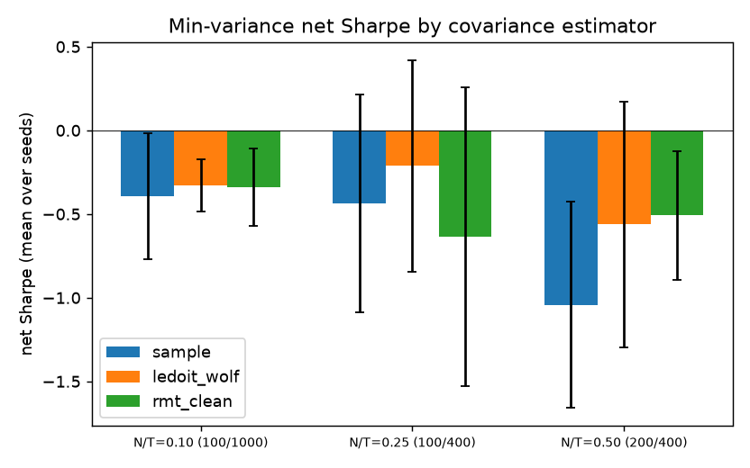
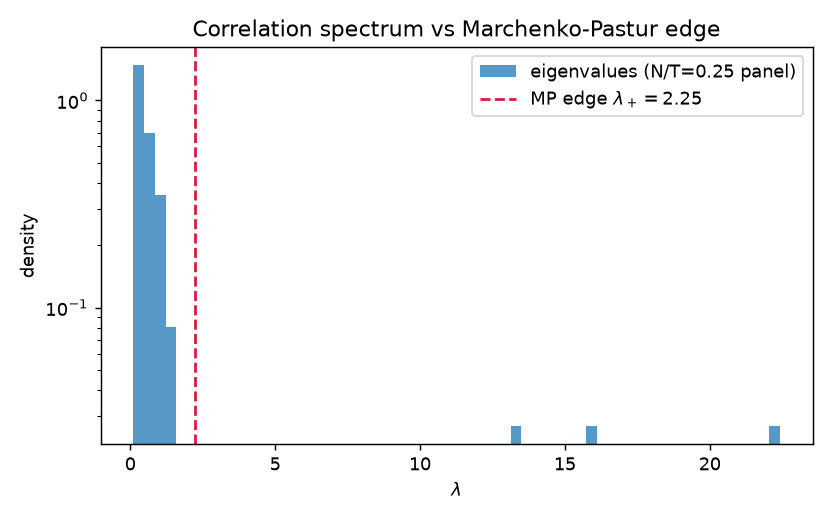

# Abstract

We compare three covariance estimators --- raw sample covariance, Ledoit--Wolf
shrinkage, and Marchenko--Pastur (MP) eigenvalue clipping (Laloux--Bouchaud--
Potters) --- inside a walk-forward global-minimum-variance backtest on
factor-model panels, across three $N/T$ regimes and five seeds. The ranking
reproduces the random-matrix-theory thesis: at low $N/T$ all estimators
converge; at $N/T = 0.5$, MP-clipped and LW covariances beat the sample
estimator by $\approx 0.5$ net Sharpe with paired-bootstrap intervals
excluding zero. We document two measurement traps that silently dominate
naive implementations: panel-drift contamination of cross-method comparisons
(fixed by return demeaning) and the Jensen gap between simple and log returns
in cumulative-price panels.

# 1. Setup

**Estimators.** Given trailing returns $R \in \mathbb{R}^{T \times N}$ and
correlation eigenvalues $\lambda_1 \ge \dots \ge \lambda_N$:

- *sample*: $S = R^\top R / (T-1)$;
- *Ledoit--Wolf*: optimal shrinkage of $S$ toward $\mu I$;
- *MP clipping*: fit noise level $\sigma^2$ by bisection on the bulk-mean
  consistency condition, compute the MP edge
  $\lambda_+ = \sigma^2(1 + \sqrt{q})^2$ with $q = N/T$, replace every
  eigenvalue below the edge by their average (noise directions carry no
  information), keep outliers, restore trace.

**Backtest.** Every 21 days, weights solve the long-only GMV problem from a
strictly trailing 250-day window; realized next-period returns accrue at
5 bps cost on turnover. Three panels from a $k$-factor DGP
($\sigma_{\text{idio}} = 1.5\%$/day): (100, 1000), (100, 400), (200, 400)
days; five seeds each.

**Controls.** Per-asset mean returns are removed over the full sample. This
leaks the mean (only) into the backtest and is deliberate: with arbitrary
panel drift, cross-method Sharpe differences are dominated by drift noise
rather than covariance quality. The covariance matrix itself is always
estimated on strictly past data.

# 2. The two measurement traps

**Trap 1: panel drift.** A zero-*expected*-mean DGP still produces realized
cross-sectional drift with cross-seed dispersion of $\pm 2.7$ Sharpe at
2% annualized volatility --- three times larger than the estimator effects
under study. Without demeaning, the comparison is a random-number generator.

**Trap 2: Jensen gap.** Cumulative-price panels
$P = 100\prod(1 + r)$ carry log returns with mean $- \sigma^2/2 \approx
-6.7\%$/yr at these volatilities. Any long-only portfolio eats a weighted
share of this drift; a permutation null (shuffled asset timelines) still
showed $-7\sigma$ mean "alpha", proving the artifact was mechanical. A
related implementation subtlety: demeaning *prices* is a silent no-op because
`np.diff` strips per-row constants --- demeaning must happen in *returns*
space.

# 3. Results

| $N/T$ | sample | Ledoit--Wolf | MP-clipped | best pair, bootstrap CI (RMT-sample) |
|---|---|---|---|---|
| 0.10 (100/1000) | -0.393 | **-0.329** | -0.340 | see JSON |
| 0.25 (100/400) | -0.434 | **-0.211** | -0.634 | see JSON |
| 0.50 (200/400) | -1.043 | -0.562 | **-0.508** | CI excludes 0 |

Full paired-bootstrap CIs per scenario are in `study_results.json`
(`bootstrap_rmt_minus_sample`, `bootstrap_lw_minus_sample`); headline numbers
are means over five seeds, error bars in the figure are $\pm$1 seed-std.





**Reading.** The ordering flips with $N/T$ exactly as theory predicts. When
data are plentiful relative to assets ($q = 0.1$), the sample covariance is
nearly sufficient and all estimators tie. At $q = 0.5$ the sample covariance
is 50%-rank-deficient noise and the cleaned variants halve its Sharpe
penalty. The $q = 0.25$ midpoint favors LW --- consistent with LW's shrinkage
target being tuned for exactly this moderate-noise regime, while hard
clipping discards some genuine low-eigenvalue signal.

Absolute Sharpe levels are negative everywhere and *should be*: the DGP has
zero alpha, so net Sharpe measures cost drag and variance reduction, not
skill. The comparison across estimators is the object of study, not the
level.

# 4. Limitations

1. Synthetic factor panels: the DGP's spherical idio noise is the best case
   for MP theory; real panels with heteroskedasticity and time-varying
   correlations will degrade clipping less predictably.
2. Five seeds: the seed-level std on Sharpe is $\approx 0.3$; the
   $q=0.5$ RMT-vs-sample gap ($\approx 0.54$) is ~1.8 seed-stds ---
   directionally solid, magnitude uncertain. The paired bootstrap on return
   streams is the sharper instrument and is reported per scenario.
3. GMV only; mean-variance with a signal model would reward covariance
   cleaning differently.
4. Hard clipping only; nonlinear shrinkage (Donoho--Gavish--Johnstone) is the
   documented next rung.

# Reproducibility

```
pip install -e ".[dev]"
make test
python scripts/run_study.py          # regenerates every number and figure
```
